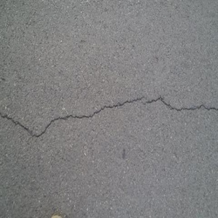
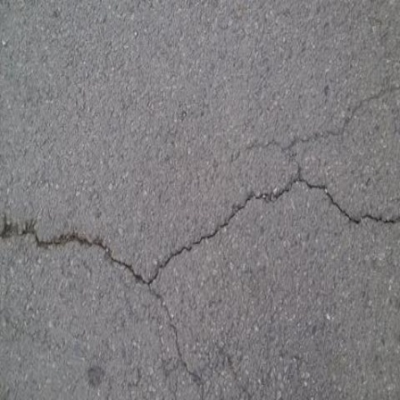
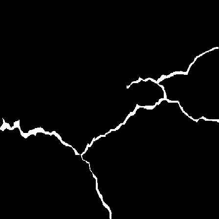
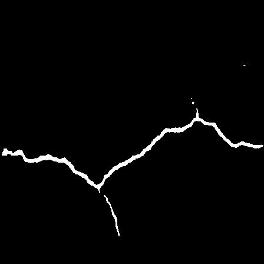

# Road Crack Segmentation using UNet

<table>
  <thead>
    <tr align="center">
      <th>Input Image</th>
      <th>Ground Truth</th>
      <th>CE Loss</th>
      <th>Dice Loss</th>
      <th>DiceCE Loss</th>
      <th>Focal Loss</th>
    </tr>
  </thead>
  <tbody>
    <tr align="center">
      <td></td>
      <td></td>
      <td></td>
      <td></td>
      <td></td>
      <td></td>
    </tr>
    <tr align="center">
     <td></td>
      <td></td>
      <td></td>
      <td></td>
      <td></td>
      <td></td>
    </tr>
    <tr align="center">
      <td>Dice Loss</td>
      <td></td>
      <td>0.9719</td>
      <td>0.9804</td>
      <td>0.9754</td>
      <td>0.9679</td>
    </tr>
  </tbody>
</table>


Road crack segmentation is the task of identifying and segmenting road cracks in images or videos of roads. In this
project we used [UNet](https://arxiv.org/abs/1505.04597v1) to detect the cracks on the road.

## Table of Contents

* [Project Description](#project-description)
* [Installation](#installation)
* [Usage](#usage)
* [Contributing](#contributing)
* [License](#license)

## Project Description

In this, Road Crack Segmentation project we have implemented UNet model to segment cracks on the road
using [Crack Segmentation dataset](https://www.kaggle.com/datasets/lakshaymiddha/crack-segmentation-dataset). We
evaluated the model's performance using different loss functions and compared their results. We have implemented
following loss functions:

- [**Cross Entropy Loss**](./crackseg/utils/losses.py)
- [**Dice Loss**]((./crackseg/utils/losses.py))
- [**Dice Cross Entropy Loss**]((./crackseg/utils/losses.py))
- [**Focal Loss**]((./crackseg/utils/losses.py))

We trained the model using above-mentioned loss functions and evaluated their performance by **Dice coefficient** (`dice
score = 1 - dice loss`, so our evaluation metric may not be right metric to compare those models with each other)

*[see here](https://github.com/yakhyo/pytorch-losses) to check full implementation of more loss functions (
_updating..._)

## Installation

Download the project:

```commandline
git clone https://github.com/yakhyo/crackseg.git
cd crackseg
```

Install requirements:

```commandline
pip install -r requirements
```

Download the weights of the model from [here](https://github.com/yakhyo/crackseg/releases/tag/v0.0.1) into `weights`
folder. Model weights trained using Dice Loss is provided inside `weights` folder as `model.pt`

## Usage

### Dataset

To train the model download the dataset and put `train` and `test` folders inside `data` folder as following:

```
data-|
     |-train-|
             |-images
             |-masks
                
     |-test -|
             |-images
             |-masks
```

### Train

```commandline
python -m tools.main
```
Training arguments:
```
python -m tools.main -h
usage: main.py [-h] [--data DATA] [--image_size IMAGE_SIZE] [--save-dir SAVE_DIR] [--epochs EPOCHS] [--batch-size BATCH_SIZE] [--lr LR] [--weights WEIGHTS] [--amp] [--num-classes NUM_CLASSES]

Crack Segmentation training arguments

optional arguments:
  -h, --help            show this help message and exit
  --data DATA           Path to root folder of data
  --image_size IMAGE_SIZE
                        Input image size, default: 512
  --save-dir SAVE_DIR   Directory to save weights
  --epochs EPOCHS       Number of epochs, default: 5
  --batch-size BATCH_SIZE
                        Batch size, default: 12
  --lr LR               Learning rate, default: 1e-5
  --weights WEIGHTS     Pretrained model, default: None
  --amp                 Use mixed precision
  --num-classes NUM_CLASSES
                        Number of classes

```

### Inference
```commandline
python -m tools.inference --weights weights/model.pt --input assets/CFD_001_image.jpg
```
Inference arguments
```
python -m tools.inference -h
usage: inference.py [-h] [--weights WEIGHTS] [--input INPUT] [--output OUTPUT] [--image-size IMAGE_SIZE] [--view] [--no-save] [--conf-thresh CONF_THRESH]

Crack Segmentation inference arguments

optional arguments:
  -h, --help            show this help message and exit
  --weights WEIGHTS     Path to weight file (default: last.pt)
  --input INPUT         Path to input image
  --output OUTPUT       Path to save mask image
  --image-size IMAGE_SIZE
                        Input image size
  --view                Visualize image and mask
  --no-save             Do not save the output masks
  --conf-thresh CONF_THRESH
                        Confidence threshold for mask

```
## Contributing

If you're going to contribute to this project, please see the [Contributing policy](.github/CONTRIBUTING.md) and
[Code of Conduct](.github/CODE_OF_CONDUCT.md). Do not hesitate to report bugs or request new features.

## License

The project is licensed under the [MIT license](LICENSE).
