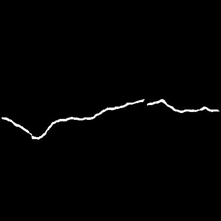
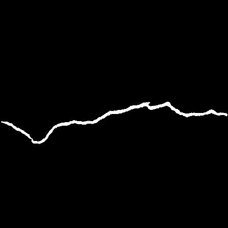
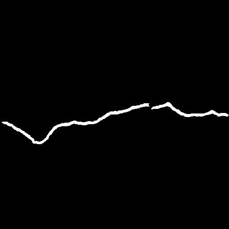
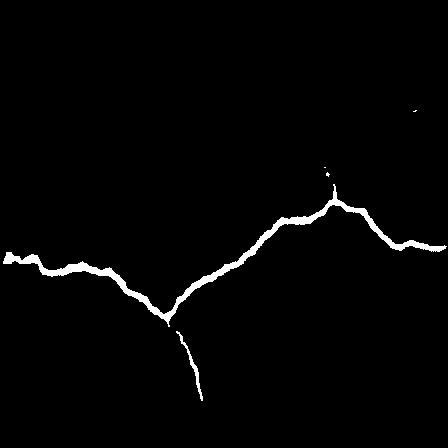
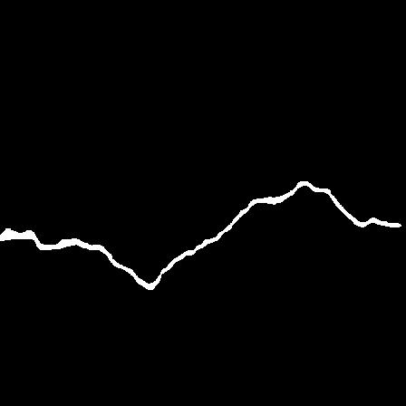
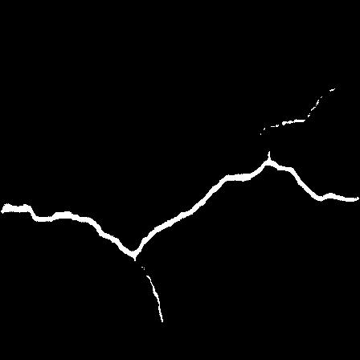
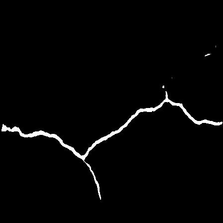

# Road Crack Segmentation

<table>
  <thead>
    <tr align="center">
      <th>Input Image</th>
      <th>Ground Truth</th>
      <th>CE Loss</th>
      <th>Dice Loss</th>
      <th>DiceCE Loss</th>
      <th>Focal Loss</th>
    </tr>
  </thead>
  <tbody>
    <tr align="center">
      <td></td>
      <td></td>
      <td></td>
      <td></td>
      <td></td>
      <td></td>
    </tr>
    <tr align="center">
     <td></td>
      <td></td>
      <td></td>
      <td></td>
      <td></td>
      <td></td>
    </tr>
    <tr align="center">
      <td>Dice Loss</td>
      <td></td>
      <td>0.9719</td>
      <td>0.9804</td>
      <td>0.9754</td>
      <td>0.9679</td>
    </tr>
  </tbody>
</table>

Briefly introduce your project in a sentence or two.

## Table of Contents

* [Project Description](#project-description)
* [Installation](#installation)
* [Usage](#usage)
* [Contributing](#contributing)
* [License](#license)

## Project Description

In this section, provide a brief description of your project, including its purpose and any key features.

## Installation

Provide step-by-step instructions for how to install your project. If there are any dependencies, make sure to list them
and explain how to install them.

## Usage

Provide examples of how to use your project. Include any relevant code snippets or screenshots.

## Contributing

If you welcome contributions from other developers, explain how they can get started. Include information on how to
report bugs, request features, or submit code changes.

## License

The project is licensed under the [MIT license](https://opensource.org/license/mit/).

# dice score

DiceCE: 0.9754
Dice: 0.9804
Focal : Dice Score: 0.9679
CE: Dice Score: 0.9719,